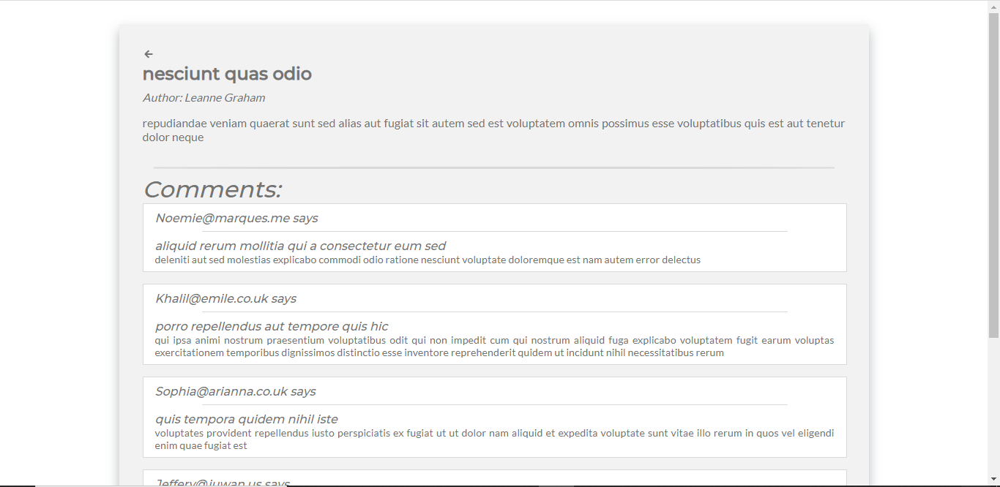

# Blogging App

## Description.

This is a basic blogging web-app developed by me, purely for practice during the initial days of my employment as a part of a trainig program. The main motive of this project was to get comfortable and hands on with React, Redux and SASS. 

This is purely a frontend application and has been developed using pre-made apis from [json placeholder.](https://jsonplaceholder.typicode.com)

## Technologies.
    
    The main technologies in the tech stack include:
    1.  ReactJs.
    2.  NodeJs.
    3.  Redux.
    4.  SASS.
    5. Javascript.

## Screenshots.

### Home Page.

### Login Page.

### Adding a new Post.

### Individual Post Page.

